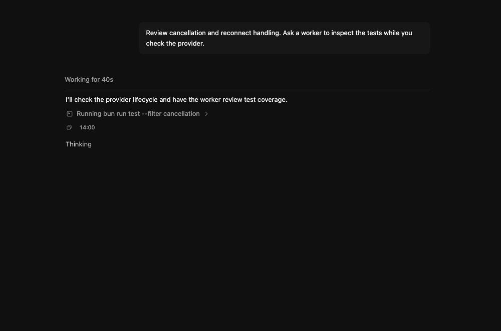
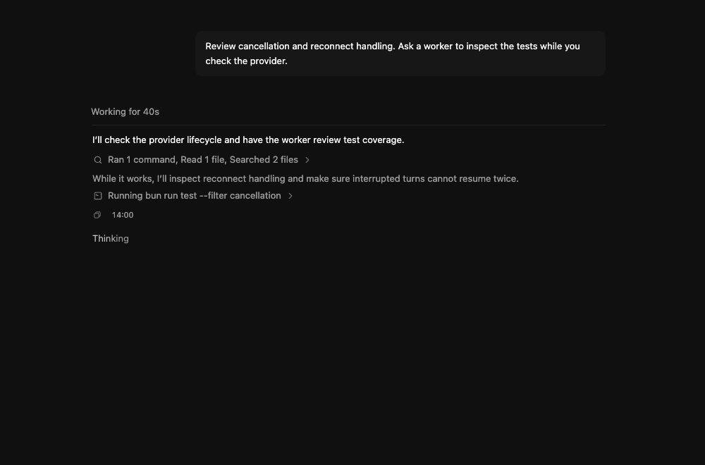
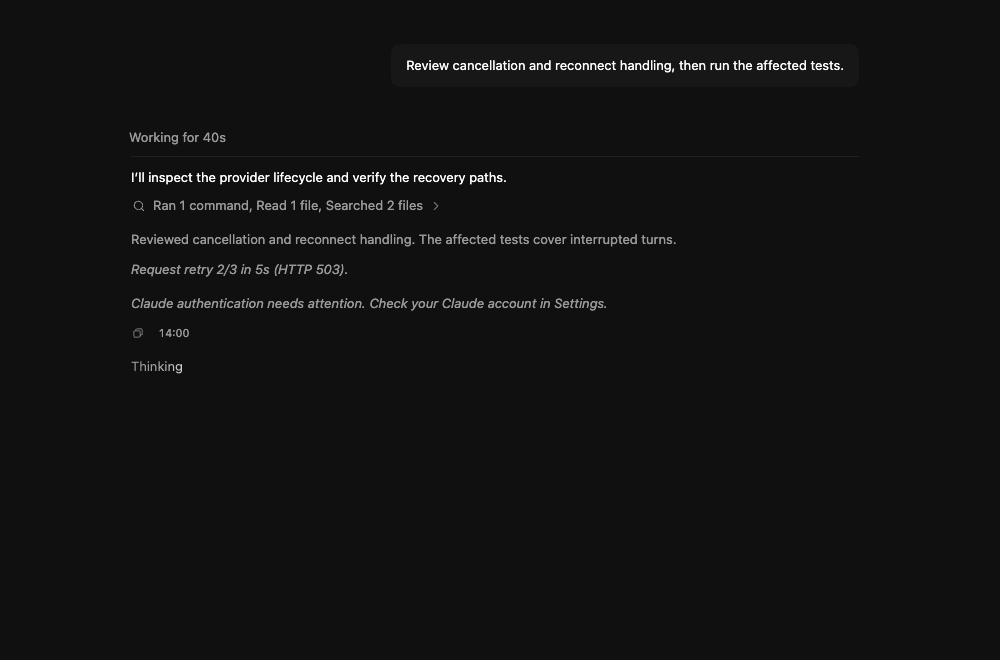

# Claude reasoning transcript comparison

Browser screenshots at 1000 x 660 of the actual Synara transcript components, using identical controlled provider events.

- Before: activity projection and affected transcript components from 094618201.
- After: implementation commit 6218883b25f055bbc76bd4efabb0a0f726849115.
- The event sequence contains completed commands, a completed Claude reasoning block, and a running command. The previous projection drops the reasoning block; the new projection displays it between command groups.
- These are fixture-based UI captures, not a live Claude session or proof of live provider behavior. Adapter and ingestion lifecycle behavior is covered separately by automated tests.

| Before | After |
| --- | --- |
|  |  |

## Additional Claude status rows

`claude-status.png` captures the real transcript components with controlled tool-summary, retry, and authentication-error events on implementation commit `b53e9a275`. It is fixture-based evidence, not a live provider session.

